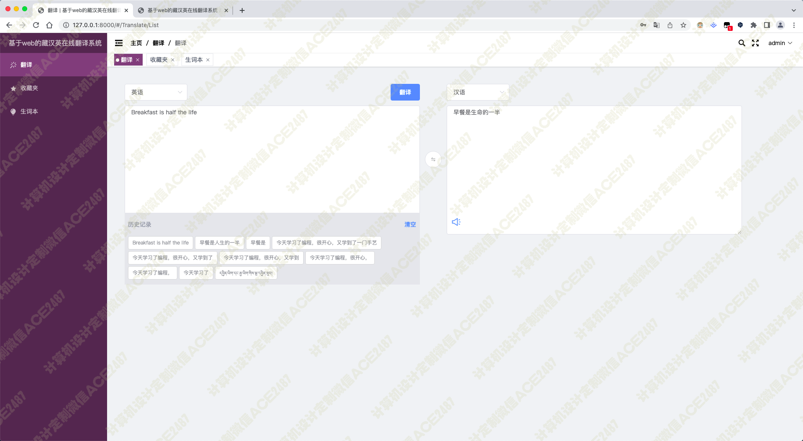
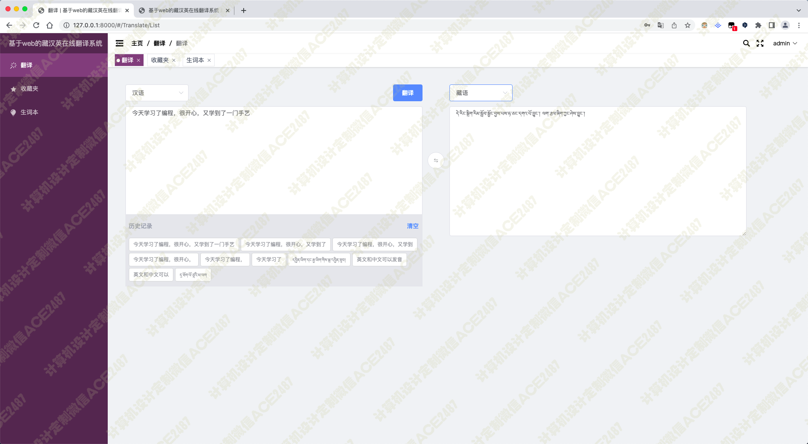
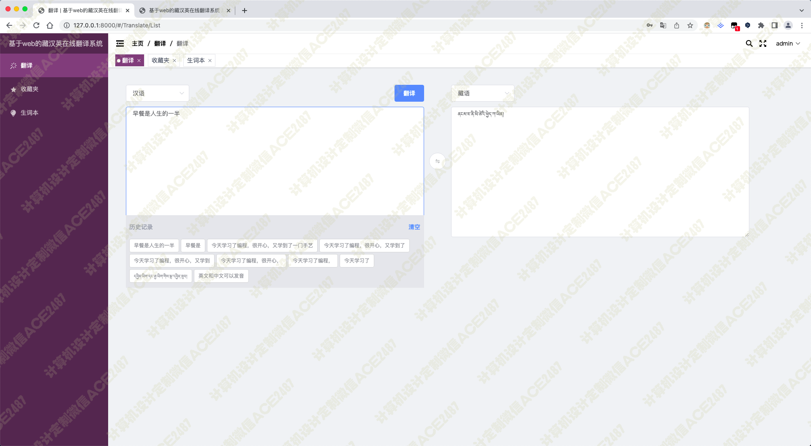
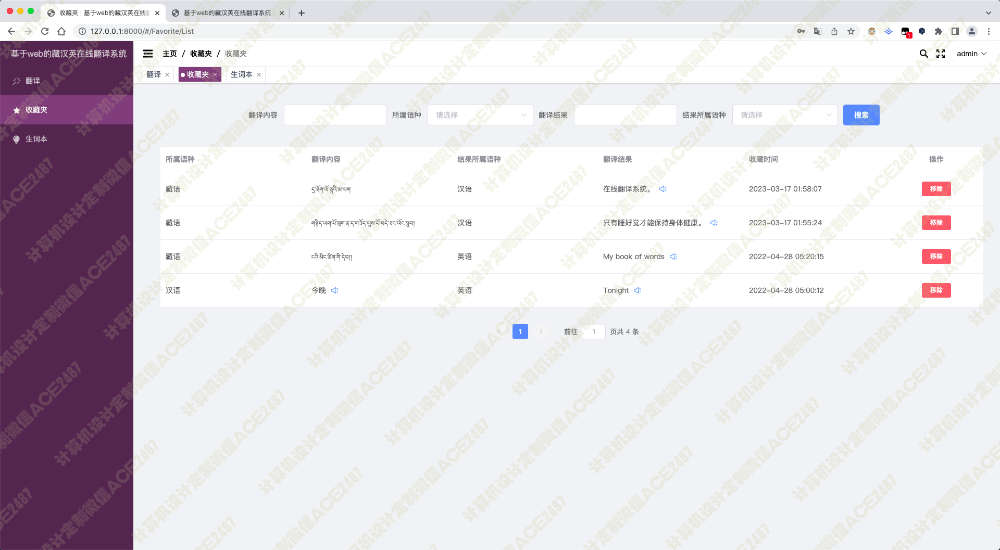
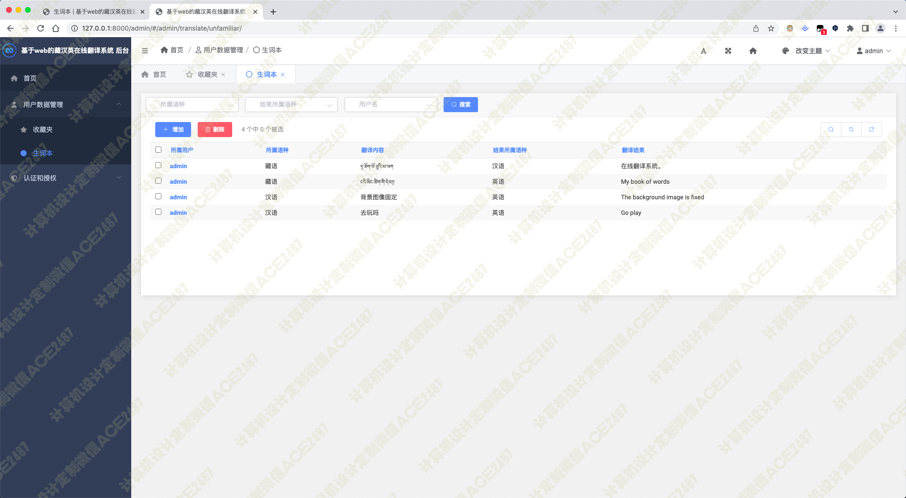
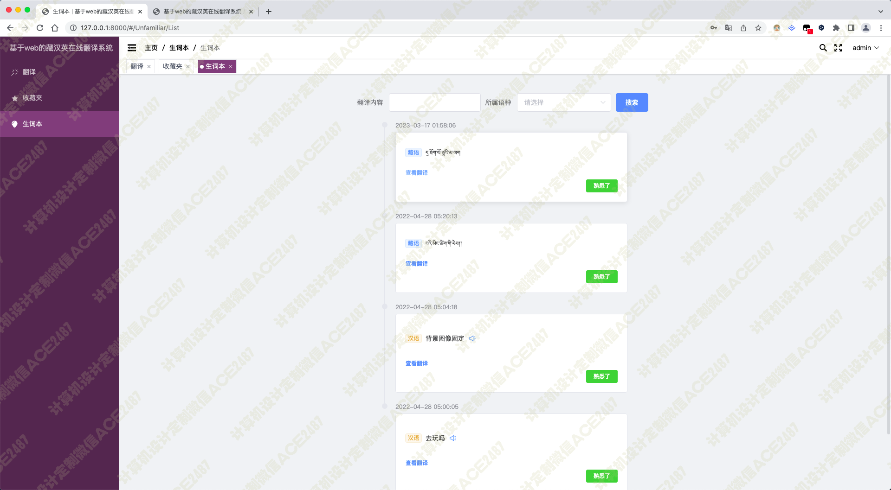

# 023 基于web的藏汉英在线翻译系统-设计展示

> **代码有偿获取 可接受定制 微信联系方式: ACE2487，备注(BS)**

> 

## 介绍

```
该系统是一个基于Web的藏汉英在线翻译系统，用户可以通过输入想要翻译的藏文、汉文或英文，系统将自动翻译成对应的汉文、藏文或英文，并且提供语音朗读功能。

技术架构
    该系统使用了Django框架作为后端，前端使用了Vue.js框架，数据库使用MySQL。同时，系统还使用了Python的机器学习库以及自然语言处理库来实现翻译功能。

翻译功能
    系统使用了机器学习算法来实现翻译功能。具体来说，系统使用了基于神经网络的翻译模型，该模型可以根据输入的源语言句子和目标语言句子来进行训练，从而实现翻译功能。在训练过程中，系统使用了大量的双语数据集来进行训练，包括汉藏、汉英和藏英等多种语言对。

语音朗读功能
    系统使用了百度AI语音合成接口来实现语音朗读功能。具体来说，系统将翻译后的文本发送给百度AI语音合成接口，接口将文本转化为语音，并返回给系统，从而实现语音朗读功能。

前后端交互
    系统前端使用了Vue.js框架来实现，后端使用Django框架来实现。前后端之间通过RESTful API进行交互，前端向后端发送请求并获取响应，从而实现系统的各种功能。

总结
    该系统是一个基于Web的藏汉英在线翻译系统，使用了Django框架作为后端，前端使用了Vue.js框架，数据库使用MySQL。同时，系统还使用了Python的机器学习库以及自然语言处理库来实现翻译功能。系统具有翻译和语音朗读功能，可以帮助用户快速准确地翻译藏文、汉文和英文，并且提供语音朗读功能，方便用户学习和使用。
```

## 技术栈

python django vue 藏语翻译 汉语翻译 英语翻译 藏汉英语互译 英语中文发音 历史翻译记录 生词本 收藏夹 后台管理用户数据

## 视频

> **点击查看 \>\>\> [https://www.bilibili.com/video/BV1Ps4y1V7FP/](https://www.bilibili.com/video/BV1Ps4y1V7FP/)**

## 截图











